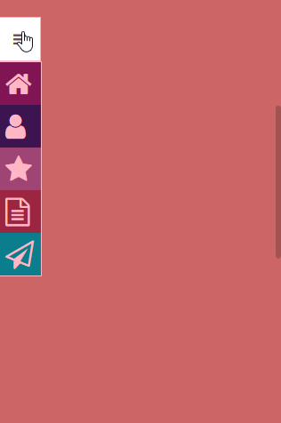

# ElasticSidebar

This is an evolving elastic sidebar menu implementation. You can preview it [here](https://franciscoknebel.github.io/ElasticSidebar).

### Example GIFs

---
## Contributing

Please read [CONTRIBUTING.md](CONTRIBUTING.md) for details on our code of conduct, and the process for submitting pull requests to us.

## Versioning

We use [SemVer](http://semver.org/) for versioning. For the versions available, see the [tags on this repository](https://github.com/FranciscoKnebel/ElasticSidebar/tags).

## Authors

* [**Francisco Knebel**](https://github.com/FranciscoKnebel) - *Initial work*

See also the list of [contributors](https://github.com/FranciscoKnebel/ElasticSidebar/contributors) who participated in this project.

## License

This project is licensed under the MIT License - see the [LICENSE](LICENSE.md) file for details
