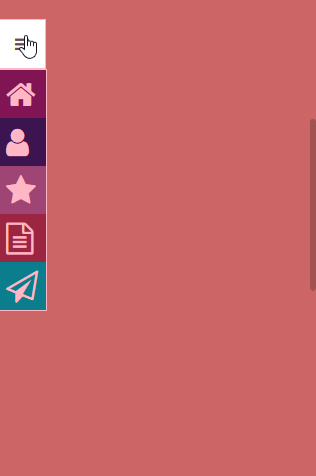
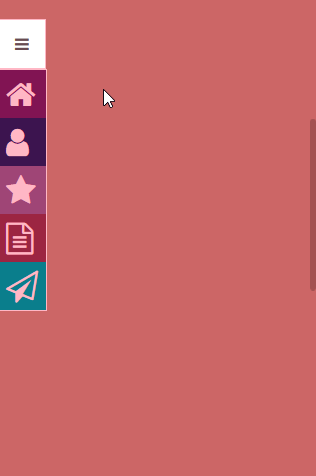

# Elastic Sidebar
[](https://www.npmjs.com/package/elasticsidebar)
[](https://www.npmjs.com/package/elasticsidebar)
[](https://travis-ci.org/FranciscoKnebel/ElasticSidebar)
[](https://github.com/FranciscoKnebel/ElasticSidebar/issues)
[](https://github.com/FranciscoKnebel/ElasticSidebar/blob/master/LICENSE)

This is an evolving elastic sidebar menu implementation. You can preview it [here](https://franciscoknebel.github.io/ElasticSidebar).


### Example GIFs



## Usage

Include in your page the [sidebar.css](https://raw.githubusercontent.com/FranciscoKnebel/ElasticSidebar/master/dist/sidebar.css) file, found in the repository [dist](https://github.com/FranciscoKnebel/ElasticSidebar/tree/master/dist) folder. In the folder, you can also find minified and gzipped versions of all files.


##### Sidebar Wrapper Element
   The sidebar is defined by the class `.em-sidebar`. All elements of the sidebar needs to belong to an element containing this class. The `.active` class defines if the sidebar is showing or not.

```
<div class="em-sidebar"></div>
// this is a hidden by default

<div class="em-sidebar active"></div>
// but this one starts active already!
```

##### Toggle Button
   You can define your own toggle button for adding and removing the `.active` class from the `.em-sidebar` element, or you can use our own implementation, by creating a div tag inside the sidebar with the `.em-toggle` class, as shown on the example below.

   **NOTE:** To use this button, you need to use a simple script to add/remove the `.active` class from the sidebar element. We provide one at our [dist](https://github.com/FranciscoKnebel/ElasticSidebar/tree/master/dist) folder.

```
<div class="em-sidebar">
	<div class="em-toggle fa fa-bars fa-1x"></div>
</div>

//fa, fa-bars and fa-1x are Font Awesome defined classes.
```
*If you don't know [Font Awesome](http://fontawesome.io/), check them out [here](http://fontawesome.io/).*

##### Menu Items
   OK, so now that we have the sidebar element and our toogle button, we can add our menu items. All you need is an **unordered list** `<ul>` and multiple **list items** `<li>`. Each list item will be a single menu item.

   Each list item should look something like this:
an icon to show when the element is not maximized and a `<span>` tag for the text.
```
<li>
	<i class="fa fa-home fa-2x" aria-hidden="true"></i>
	<span>HOME</span>
</li>
```
  If you would like the menu item to act as an hyperlink, you only need to wrap the list item contents with an `<a>` tag.

```
<li>
	<a href="/">
		<i class="fa fa-home fa-2x" aria-hidden="true"></i>
		<span>HOME</span>
	</a>
</li>
```


##### Full Example
This is what a finished menu with 5 elements looks like:
```
<div class="em-sidebar">
	<div class="em-toggle fa fa-bars fa-1x"></div>
	<ul>
		<li>
			<i class="fa fa-home fa-2x" aria-hidden="true"></i>
			<span>HOME</span>
		 </li>
		<li>
			<i class="fa fa-user fa-2x" aria-hidden="true"></i>
			<span>BIO</span>
		</li>
		<li>
			<i class="fa fa-star fa-2x" aria-hidden="true"></i>
			<span>PORTFOLIO</span>
		</li>
		<li>
			<i class="fa fa-file-text-o fa-2x" aria-hidden="true"></i>
			<span>CV</span>
		</li>
		<li>
			<i class="fa fa-paper-plane-o fa-2x" aria-hidden="true"></i>
			<span>CONTACT</span>
		</li>
	</ul>
</div>
```

---
## Building

The [BUILDING.md](BUILDING.md) has all the details if you want to customize and rebuild Elastic Sidebar.

## Contributing

Please read [CONTRIBUTING.md](CONTRIBUTING.md) for details on our code of conduct, and the process for submitting pull requests to us.

## Versioning

We use [SemVer](http://semver.org/) for versioning. For the versions available, see the [tags on this repository](https://github.com/FranciscoKnebel/ElasticSidebar/tags).

## Authors

* [**Francisco Knebel**](https://github.com/FranciscoKnebel) - *Initial work*

See also the list of [contributors](https://github.com/FranciscoKnebel/ElasticSidebar/contributors) who participated in this project.

## License

This project is licensed under the MIT License - see the [LICENSE](LICENSE.md) file for details
